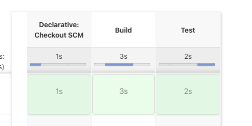

# Getting Started

### Spring Boot Pet Clinic app
### Prerequisites
* Install Docker: https://docs.docker.com/desktop/mac/install/
* Install Jenkins: https://www.jenkins.io/download/
* Install Intellij community: https://www.jetbrains.com/idea/download/#section=mac
### Create a docker image for the app
* Clone the app from the GitHub
  * $ git clone https://github.com/prahul/spring-petclinic.git
* Clean a build your project
  * cd <project toot directory>
  * ./gradlew clean build
* Create the docker image
  * $ docker build -t spring-petclinic .
  * $ docker images
* Run the app
  * $ docker run -p 8080:8080 spring-petclinic
  * Open a browser: http://localhost:8080
### Configure and run Jenkins pipeline
* Login to Jenkins. Make sure no other app is running on port 8080
  * http://localhost:8080
  * Go to Dashboard -> New Item
    * Give a name to your app "spring-petclinic"
  * Select Pipeline
    * **Definition**: Pipeline Script from SCM
    * **SCM**: Git
    * **Repositories/Repository URL** : https://github.com/prahul/spring-petclinic
    * **Branched to build/Branch Specifier** : */main
    * **Script path**: Jenkinsfile
  * Save the configurations
  * Click on **Build Now** and your pipeline stages will build. The srages will look like below.
  
### Improvements
* Create a start.sh script which will do all the setup without any manual work
* Add gradle plugin to create the docker image from Jenkins pipeline
* Add gradle plugin to push the image to artifactory
